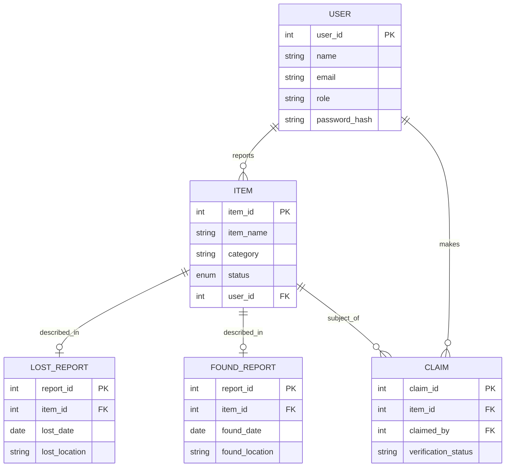

# 🧩 Entity-Relationship (ER) Diagram

The ER diagram visualizes the database structure for the Campus Lost & Found System. It defines the entities, their attributes, and the relationships between them.

## 🔷 Entities & Attributes

1.  **User**
    *   **PK** `user_id`: Unique identifier for each user.
    *   `name`: Full name of the user.
    *   `email`: Email address (used for login/contact).
    *   `phone`: Contact number (optional).
    *   `role`: 'Student', 'Staff', or 'Admin'.

2.  **Item**
    *   **PK** `item_id`: Unique identifier for each item.
    *   `item_name`: Name of the item.
    *   `category`: Type (Electronics, Books, etc.).
    *   `description`: Details about the item.
    *   `location`: Where it was lost/found.
    *   `date_reported`: Date of reporting.
    *   `status`: 'Lost', 'Found', 'Returned', 'Claimed'.
    *   **FK** `user_id`: The user who reported the item.

3.  **Lost_Report**
    *   **PK** `report_id`: Unique identifier.
    *   **FK** `item_id`: Link to the Item table.
    *   `lost_date`: Specific date item was lost.
    *   `lost_location`: Specific location where it was lost.

4.  **Found_Report**
    *   **PK** `report_id`: Unique identifier.
    *   **FK** `item_id`: Link to the Item table.
    *   `found_date`: Specific date item was found.
    *   `found_location`: Specific location where it was found.

5.  **Claim**
    *   **PK** `claim_id`: Unique identifier.
    *   **FK** `item_id`: The item being claimed.
    *   **FK** `claimed_by`: The user participating in the claim.
    *   `claim_date`: Timestamp of the claim.
    *   `verification_status`: 'Pending', 'Approved', 'Rejected'.

## 🔗 Relationships

1.  **User ↔ Item (1:N)**
    *   One **User** can report many **Items**.
    *   Each **Item** is reported by exactly one **User**.

2.  **Item ↔ Lost_Report / Found_Report (1:1)**
    *   Each **Item** can have associated details in either **Lost_Report** (if reported lost) or **Found_Report** (if reported found).
    *   This is a specialization; an item is initially either a "Lost Item" or "Found Item".

3.  **Item ↔ Claim (1:1)**
    *   An **Item** (specifically a 'Found' item) can have one active **Claim** process at a time (simplified for this system).
    *   Ideally, an item can be claimed, but only one claim is approved.

4.  **User ↔ Claim (1:N)**
    *   One **User** can make multiple **Claims** for different found items.
    *   Each **Claim** is made by one **User**.

## 📊 Visual Representation (Mermaid)

